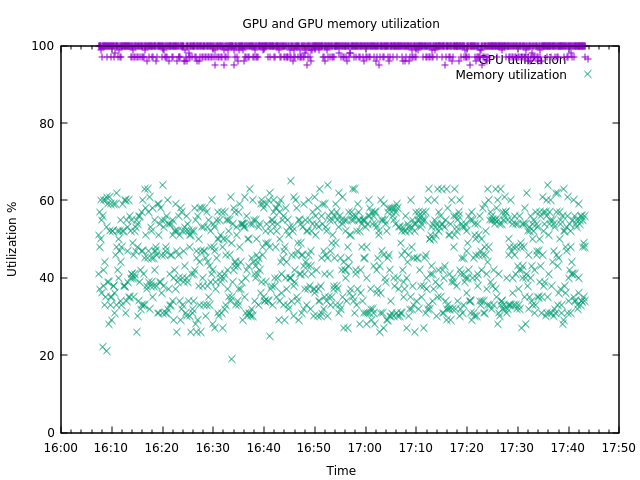
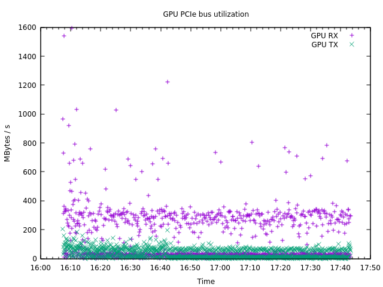
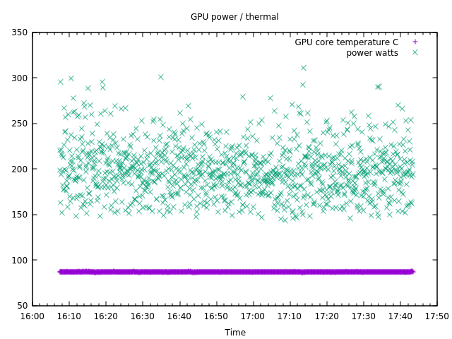

# gpu_monitor

To record GPU use data:

bash ./src/main/scripts/monitor.sh

This will use nvidia-smi to record GPU info as XML every 5 seconds (edit the script for alternative interval).


To analyze data directory:

mvn -q exec:java -Dexec.mainClass=ie.strix.gpumon.GpuMon -Dexec.args="(datadir)" > gpu.dat

Substitute (datadir) for the directory in which the XML files are stored. This will condense
the information in the XML files into a space separated one-record-per-line file suitable
for use with Gnuplot.

The fields are: 

timestamp, gpu-id, gpu-util-percent, memory-util-percent, bus-rx-kBps, bus-txkBps, temp-C, fan-rpm, power-watts


Plot the data:

```
gnuplot src/main/scripts/gpu_util.gnuplot
gnuplot src/main/scripts/bus_bw.gnuplot
gnuplot src/main/scripts/power.gnuplot
```

## Example plots




